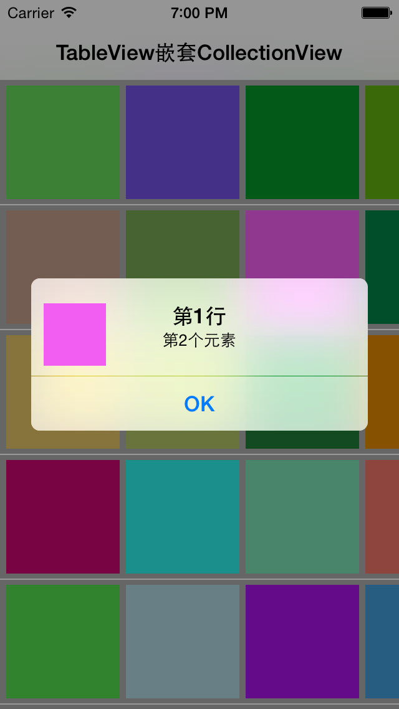

DHCollectionTableView
=====================
####用Swift实现UITableView内嵌套UICollectionView的效果如下:
 
####不用担心每个item的索引获取
 

How to use
==========
  
    // source就是要显示的数据,图片什么的,随意啦, format: Array<Array<AnyObject>>
    let viewController = DHCollectionTableViewController(source: mutableArray)
    self.root = UINavigationController(rootViewController: viewController)

Thanks
======

Ash Furrow's objc-proj on GitHub: https://github.com/AshFurrow/AFTabledCollectionView

License
=======

These specifications and CocoaPods are available under the [MIT license](http://opensource.org/licenses/mit-license.php).
